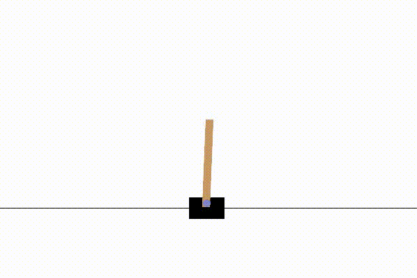
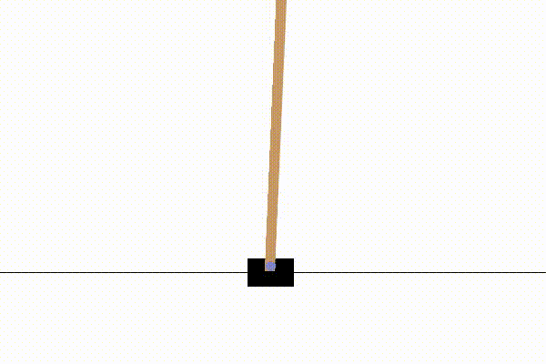
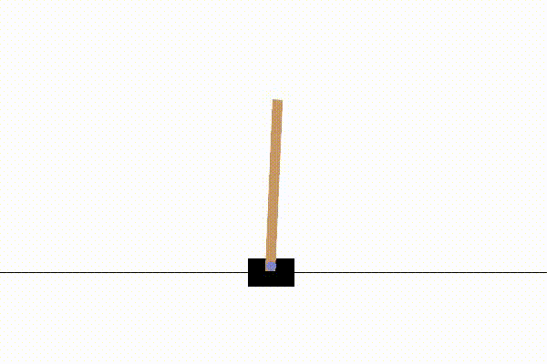

## Cartpole environment changes
Environment tested: 

0. Cartpole original environment: pole_length = $0.5$, mass_cart= $1.0$, mass_pole = $0.1$, gravity = $9.8$
1. Carpotle Mod 1: pole_length = $0.75$, mass_cart = $1.0$, mass_pole = $0.1$, gravity = $9.8$
2. Carpotle Mod 2: pole_length = $1.0$, mass_cart = $1.0$, mass_pole = $0.1$, gravity = $9.8$
3. Carpotle Mod 3: pole_length = $1.25$, mass_cart = $1.0$, mass_pole = $0.1$, gravity = $9.8$
4. Carpotle Mod 4: pole_length = $0.75$, mass_cart = $1.0$, mass_pole = $0.1$, gravity = $19.6$
5. Carpotle Mod 5: pole_length = $1.0$, mass_cart = $1.0$,mass_pole = $0.1$, gravity = $29.4$

| cartpole 0      | cartpole_1 | cartpole 2  |
| ----------- | ----------- | ----------- |
|  | | |

| cartpole 3      | cartpole_4 | cartpole_5 |
| ----------- | ----------- | ----------- |
|  | | |

